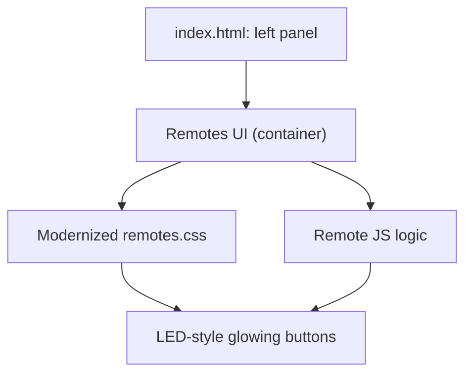

# Integration Plan: Chinese Remote Web Components in `index.html`

## 1. Integration Location

- **Target Area:**  
  The remotes will be placed in the left panel of `jasmine/index.html`, directly under the table with the test buttons (after line 91, before the closing div for class="left").

---

## 2. Component Integration Steps

### a. HTML

- **Extract** the `<div class="container">...</div>` block from `jasmine/chinese_remotes/remotes.html`.
- **Insert** this block into `jasmine/index.html` after the test buttons table in the left panel.

### b. CSS

- **Include** the `remotes.css` stylesheet in `index.html`’s `<head>`, using the correct relative path:  
  `<link rel="stylesheet" href="chinese_remotes/remotes.css">`
- **Modernize the styling:**
  - Update `remotes.css` to use a more modern, glowing button style, inspired by the LED effects already present in `index.html` (e.g., using box-shadow, gradients, and smooth hover transitions).
  - Ensure the remotes fit visually and spatially within the left panel, removing fixed positioning and using flex/grid as needed.

### c. JavaScript

- **Wire up the buttons** so they trigger the appropriate remote control logic:
  - Include `RemoteCodeTranslator.js`, `RemoteController.js`, and `RemoteEventHandlers.js` in `index.html` via `<script>` tags.
  - Ensure event listeners are attached to the remote buttons, using the logic from `RemoteEventHandlers.js`.
  - If necessary, refactor `RemoteEventHandlers.js` to work with the new DOM structure (since the remotes will now be part of `index.html`, not a standalone page).

---

## 3. Styling Modernization

- **Glowing Effect:**  
  - Use CSS box-shadow and gradients to give each remote button a glowing effect, similar to the LED indicators in `index.html`.
  - Example for a glowing red button:
    ```css
    .red_remote_red_score {
      background: #ef4949;
      box-shadow: 0 0 10px 2px #ff4d4d, 0 0 40px 10px #ff4d4d55;
      border-radius: 8px;
      color: white;
      font-weight: bold;
      transition: box-shadow 0.2s;
    }
    .red_remote_red_score:active {
      box-shadow: 0 0 20px 6px #ff4d4d, 0 0 60px 20px #ff4d4d99;
    }
    ```
  - Apply similar effects for green and other buttons, matching the LED color scheme.

- **Layout:**  
  - Remove or adjust any fixed positioning in `remotes.css`.
  - Use flex or grid to ensure the remotes are responsive and fit within the left panel.

---

## 4. JavaScript Wiring

- **Ensure all button events** (mousedown, mouseup) are connected to the correct handlers as in `RemoteEventHandlers.js`.
- **Adapt event handler code** if necessary to work with the new structure (e.g., if shadow DOM selectors are used, update to direct selectors).

---

## 5. File Inclusion

- **Add the following to `index.html`:**
  - `<link rel="stylesheet" href="chinese_remotes/remotes.css">` in the `<head>`
  - `<script src="chinese_remotes/RemoteCodeTranslator.js"></script>`
  - `<script src="chinese_remotes/RemoteController.js"></script>`
  - `<script src="chinese_remotes/RemoteEventHandlers.js"></script>`

---

## 6. Diagram



---

## 7. Summary of Steps

1. Insert the remotes UI HTML into the left panel under the buttons.
2. Update `remotes.css` for modern, glowing styles and better layout.
3. Include `remotes.css` and the three JS files in `index.html`.
4. Ensure all remote buttons are fully wired up and functional.
5. Test for visual integration and interactivity.

---

**Please review this plan. If you approve, I will proceed to implementation.**